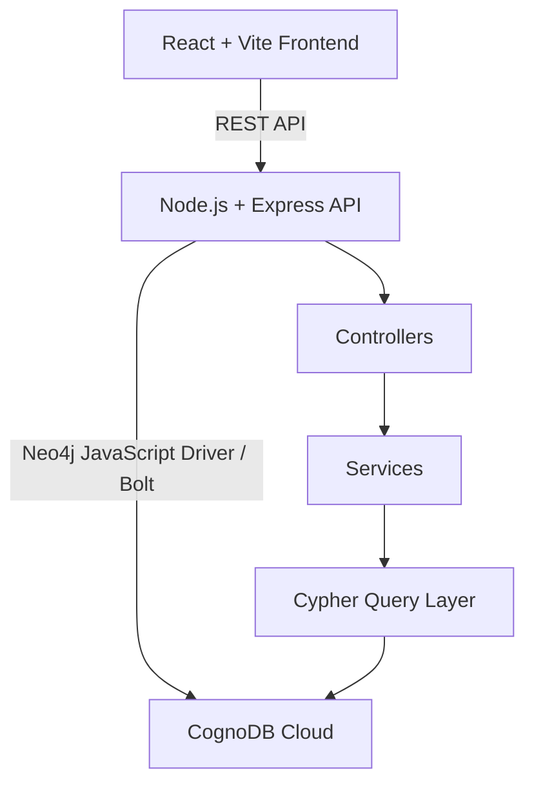
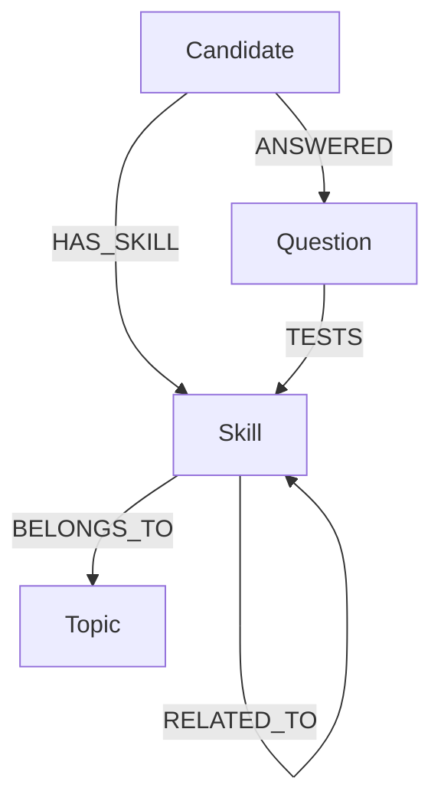
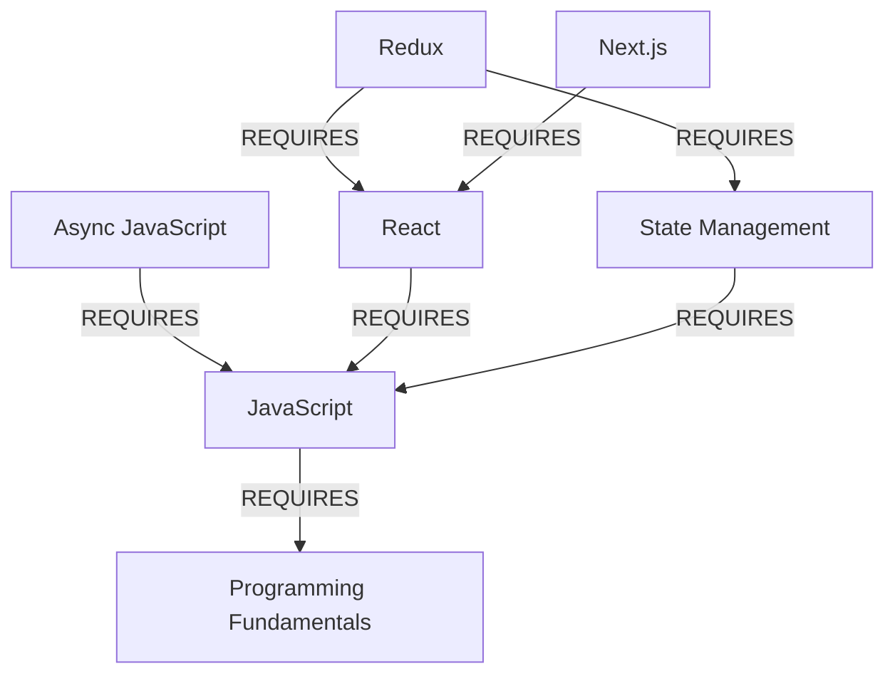
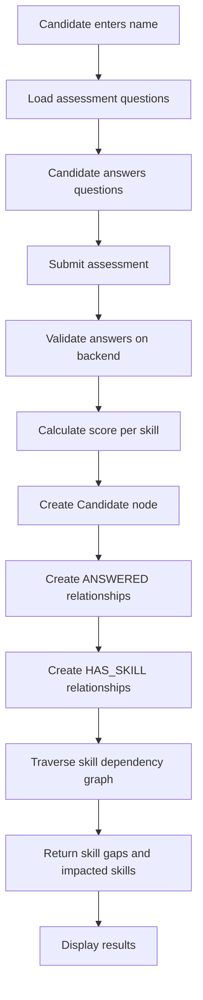

# SkillGraph

**SkillGraph** is a developer skill assessment and skill-gap analysis application powered by **CognoDB**, a graph database compatible with openCypher and the Neo4j JavaScript driver.

Instead of only returning a quiz score, SkillGraph models how technical skills depend on one another. After a candidate completes the assessment, the application calculates skill-level scores and uses graph traversals to identify weaknesses and the higher-level skills those weaknesses may affect.

---

## Live Demo

- Frontend: `ADD_FRONTEND_DEPLOYMENT_URL`
- Backend Health Check: `ADD_BACKEND_URL/api/health`
- Screen Recording: `ADD_SCREEN_RECORDING_URL`

> Replace the placeholders above after deployment.

---

## Features

- Developer skill assessment
- Skill-level scoring
- Personalized skill-gap analysis
- Multi-hop prerequisite traversal
- Interactive skill dependency explorer
- Graph-based impact analysis for weak skills
- Realistic seed data
- Parameterized Cypher queries
- Graceful API and database error handling
- Responsive UI with loading, empty, and error states

---

## Why a Graph Database?

The core problem in SkillGraph is not simply storing questions and scores. The interesting part is understanding the **relationships between skills**.

For example:

```text
Next.js
   ↓ REQUIRES
React
   ↓ REQUIRES
JavaScript
   ↓ REQUIRES
Programming Fundamentals
```

A candidate may score poorly in JavaScript. That weakness can affect readiness for React and Next.js, even if those skills are not directly tested in the same question.

With a graph database, these relationships are stored as first-class connections and can be traversed naturally using Cypher.

A relational database could model the same information, but discovering arbitrary-depth prerequisite chains or determining which higher-level skills are affected by a weakness would require recursive queries or increasingly complex self-joins.

CognoDB allows SkillGraph to express these questions directly through graph traversal.

---

## Example Graph Questions

SkillGraph can answer questions such as:

- What skills are required before learning Next.js?
- Which prerequisites are two or more levels deep?
- Which skills are affected by a candidate's weakness in React?
- Which assessment questions test a particular skill?
- What knowledge areas does each skill belong to?
- What learning dependencies connect one technology to another?

---

## Technology Stack

### Frontend

- React
- Vite
- Ant Design
- React Router
- Axios
- React Flow (`@xyflow/react`)

### Backend

- Node.js
- Express.js
- Neo4j JavaScript Driver
- dotenv
- CORS
- Helmet

### Database

- CognoDB Cloud
- openCypher
- Bolt protocol

---

## Architecture



The frontend never connects directly to CognoDB. Database credentials remain on the backend and are read from environment variables.

---

## Graph Data Model



### Nodes

#### Candidate

Represents a person who completes an assessment.

Example properties:

```text
id
name
createdAt
```

#### Question

Represents an assessment question.

Example properties:

```text
id
text
options
correctAnswer
difficulty
```

#### Skill

Represents a technical skill.

Example properties:

```text
id
name
description
```

#### Topic

Represents a broad knowledge area.

Example properties:

```text
id
name
description
```

---

## Relationships

### `(:Question)-[:TESTS]->(:Skill)`

Connects an assessment question to the skill it evaluates.

### `(:Skill)-[:BELONGS_TO]->(:Topic)`

Places a skill inside a broader knowledge area.

### `(:Skill)-[:REQUIRES]->(:Skill)`

Represents prerequisite knowledge.

Example:

```text
Next.js -[:REQUIRES]-> React
React   -[:REQUIRES]-> JavaScript
```

### `(:Skill)-[:RELATED_TO]->(:Skill)`

Represents closely related technical skills.

### `(:Candidate)-[:ANSWERED]->(:Question)`

Stores candidate responses.

Relationship properties include:

```text
answer
correct
answeredAt
```

### `(:Candidate)-[:HAS_SKILL]->(:Skill)`

Stores assessment results for each tested skill.

Relationship properties include:

```text
score
correctAnswers
totalQuestions
assessedAt
```

---

## Example Skill Graph



This model enables multi-hop traversals such as:

```text
Next.js
→ React
→ JavaScript
→ Programming Fundamentals
```

---

## Main Cypher Queries

### 1. Find all skills

```cypher
MATCH (skill:Skill)
OPTIONAL MATCH (skill)-[:BELONGS_TO]->(topic:Topic)

RETURN
  skill.id AS id,
  skill.name AS name,
  skill.description AS description,
  topic.id AS topicId,
  topic.name AS topicName

ORDER BY topic.name, skill.name
```

---

### 2. Multi-Hop Prerequisite Traversal

```cypher
MATCH (skill:Skill {id: $skillId})

OPTIONAL MATCH path =
  (skill)-[:REQUIRES*1..4]->(prerequisite:Skill)

RETURN
  skill.id AS skillId,
  skill.name AS skillName,
  prerequisite.id AS id,
  prerequisite.name AS name,
  prerequisite.description AS description,
  min(length(path)) AS distance

ORDER BY distance, name
```

The query follows `REQUIRES` relationships from one to four levels deep.

For `nextjs`, the result can include:

```text
React                     → 1 hop
JavaScript                → 2 hops
Programming Fundamentals → 3 hops
```

This is one of the main graph-specific queries in the project.

---

### 3. Skill Gap Impact Analysis

```cypher
MATCH (candidate:Candidate {
  id: $candidateId
})-[assessment:HAS_SKILL]->(weakSkill:Skill)

WHERE assessment.score < $threshold

OPTIONAL MATCH path =
  (affectedSkill:Skill)
  -[:REQUIRES*1..4]->
  (weakSkill)

RETURN
  weakSkill.id AS weakSkillId,
  weakSkill.name AS weakSkillName,
  assessment.score AS score,
  affectedSkill.id AS affectedSkillId,
  affectedSkill.name AS affectedSkillName,
  CASE
    WHEN path IS NULL THEN null
    ELSE length(path)
  END AS distance

ORDER BY score ASC, distance ASC
```

If a candidate performs poorly in React, the graph can discover that this may affect skills such as Next.js or Redux because those skills depend on React.

---

## Parameterized Queries

All dynamic Cypher values are passed through Neo4j driver parameters.

Example:

```javascript
await session.run(GET_SKILL_PREREQUISITES, {
  skillId,
});
```

The Cypher query uses:

```cypher
{id: $skillId}
```

instead of constructing queries through string concatenation.

---

## Assessment Flow



---

## API Endpoints

### Health

```http
GET /api/health
```

Checks both the Express server and CognoDB connection.

### Skills

```http
GET /api/skills
```

Returns all skills.

```http
GET /api/skills/:skillId
```

Returns details for a single skill.

```http
GET /api/skills/:skillId/prerequisites
```

Returns multi-hop prerequisites.

```http
GET /api/skills/:skillId/graph
```

Returns graph nodes and edges used by the Skill Explorer.

### Questions

```http
GET /api/questions
```

Returns assessment questions without exposing the correct answers.

### Assessments

```http
POST /api/assessments
```

Example request:

```json
{
  "candidateName": "Demo Candidate",
  "answers": [
    {
      "questionId": "q1",
      "answer": "let"
    },
    {
      "questionId": "q2",
      "answer": "await"
    }
  ]
}
```

The backend:

1. Validates question IDs
2. Fetches correct answers from CognoDB
3. Evaluates submitted responses
4. Calculates skill scores
5. Creates the candidate
6. Creates `ANSWERED` relationships
7. Creates `HAS_SKILL` relationships
8. Runs graph-based skill-gap analysis

---

## Project Structure

```text
skill-graph/
│
├── client/
│   ├── src/
│   │   ├── components/
│   │   │   └── SkillGraphView.jsx
│   │   ├── pages/
│   │   │   ├── DashboardPage.jsx
│   │   │   ├── AssessmentPage.jsx
│   │   │   ├── ResultsPage.jsx
│   │   │   └── SkillExplorerPage.jsx
│   │   ├── services/
│   │   │   └── api.js
│   │   ├── App.jsx
│   │   ├── main.jsx
│   │   └── styles.css
│   └── package.json
│
├── server/
│   ├── scripts/
│   │   ├── seed.js
│   │   └── seedData.js
│   ├── src/
│   │   ├── config/
│   │   │   └── database.js
│   │   ├── controllers/
│   │   ├── middleware/
│   │   ├── queries/
│   │   ├── routes/
│   │   ├── services/
│   │   ├── app.js
│   │   └── server.js
│   ├── .env.example
│   └── package.json
│
├── docs/
│
├── .gitignore
└── README.md
```

---

## Local Setup

### Prerequisites

Make sure you have:

- Node.js 20+
- npm
- Git
- A CognoDB Cloud account
- A CognoDB database instance

---

## 1. Clone the Repository

```bash
git clone YOUR_GITHUB_REPOSITORY_URL
cd skill-graph
```

---

## 2. Create a CognoDB Instance

1. Sign in to CognoDB Cloud.
2. Create a free `c0` instance.
3. Select a suitable region.
4. Save the generated database password immediately.
5. Copy the Bolt connection URI.

The connection URI will look similar to:

```text
bolt+s://<instance-id>.databases.cognodb.cloud
```

The default database username is:

```text
cognodb
```

---

## 3. Backend Setup

Navigate to the server:

```bash
cd server
```

Install dependencies:

```bash
npm install
```

Create:

```text
server/.env
```

Add:

```env
PORT=5000

COGNODB_URI=bolt+s://YOUR_INSTANCE_ID.databases.cognodb.cloud
COGNODB_USERNAME=cognodb
COGNODB_PASSWORD=YOUR_PASSWORD
```

Never commit this file.

An `.env.example` file is included in the repository.

---

## 4. Seed CognoDB

From the `server` directory:

```bash
npm run seed
```

The seed script creates:

- Topics
- Skills
- Questions
- `BELONGS_TO` relationships
- `REQUIRES` relationships
- `RELATED_TO` relationships
- `TESTS` relationships

It also runs a sample multi-hop traversal to verify the graph.

Example output:

```text
Starting SkillGraph database seed...

Seeded 4 topics
Seeded 18 skills
Created BELONGS_TO relationships
Created REQUIRES relationships
Created RELATED_TO relationships
Seeded 12 questions
Created TESTS relationships

Next.js prerequisite traversal:

React - 1 hop(s)
JavaScript - 2 hop(s)
Programming Fundamentals - 3 hop(s)

SkillGraph seed completed successfully.
```

---

## 5. Start the Backend

```bash
npm run dev
```

The API runs at:

```text
http://localhost:5000
```

Test:

```text
http://localhost:5000/api/health
```

Expected response:

```json
{
  "success": true,
  "server": "healthy",
  "database": "connected",
  "result": 1
}
```

---

## 6. Frontend Setup

Open another terminal:

```bash
cd client
npm install
```

Create:

```text
client/.env
```

Add:

```env
VITE_API_BASE_URL=http://localhost:5000/api
```

Start the frontend:

```bash
npm run dev
```

Open:

```text
http://localhost:5173
```

---

## Environment Variables

### Backend

```env
PORT=
COGNODB_URI=
COGNODB_USERNAME=
COGNODB_PASSWORD=
```

### Frontend

```env
VITE_API_BASE_URL=
```

Actual `.env` files are excluded from Git.

---

## Error Handling

The application includes handling for:

- Invalid candidate data
- Missing assessment answers
- Duplicate question submissions
- Invalid question IDs
- Missing skills
- API errors
- CognoDB connectivity failures
- Frontend loading states
- Frontend empty states
- Frontend request failures

If CognoDB is unavailable, the API health endpoint returns an appropriate service-unavailable response rather than crashing silently.

---

## Screenshots

Add deployed screenshots to the `docs/` directory and update the paths below.

### Dashboard

```md

```

### Assessment

```md

```

### Results

```md

```

### Skill Gap Analysis

```md

```

### Skill Explorer

```md

```

Recommended README usage after the screenshots exist:

```markdown


```

---

## Deployment

The application is designed to be deployed as:

```text
React / Vite
      ↓
Frontend Hosting
      ↓
Express REST API
      ↓
Backend Hosting
      ↓
CognoDB Cloud
```

When deploying the backend, configure:

```text
COGNODB_URI
COGNODB_USERNAME
COGNODB_PASSWORD
PORT
```

When deploying the frontend, configure:

```text
VITE_API_BASE_URL=https://YOUR_BACKEND_DOMAIN/api
```

---

## Security Notes

- CognoDB credentials are never sent to the browser.
- Database credentials are loaded through environment variables.
- `.env` files are excluded from version control.
- Correct assessment answers are not returned through the questions API.
- Dynamic Cypher values use query parameters instead of string concatenation.
- Database writes for an assessment are grouped in a transaction.

---

## Future Improvements

Given more time, SkillGraph could be extended with:

- Larger skill and question datasets
- Candidate assessment history
- Recommended personalized learning paths
- Difficulty-weighted scoring
- More detailed graph visualization
- Assessment categories
- Skill search and filtering
- Admin tooling for managing skills and questions

Authentication was intentionally left outside the current scope so the project could focus on graph modelling, traversal, assessment logic, and user experience.

---

## Author

**Athul Sudhakaran**

---

## License

This project was created as a technical take-home assessment.
