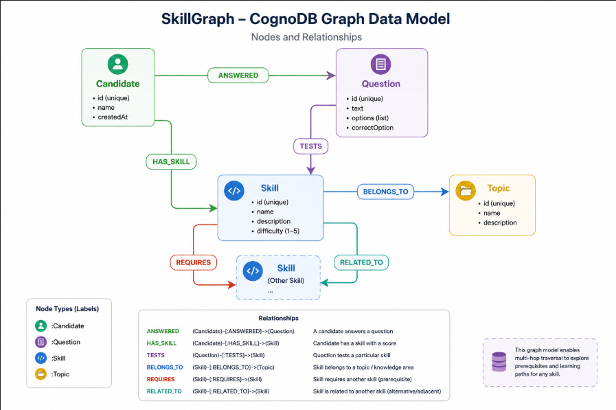
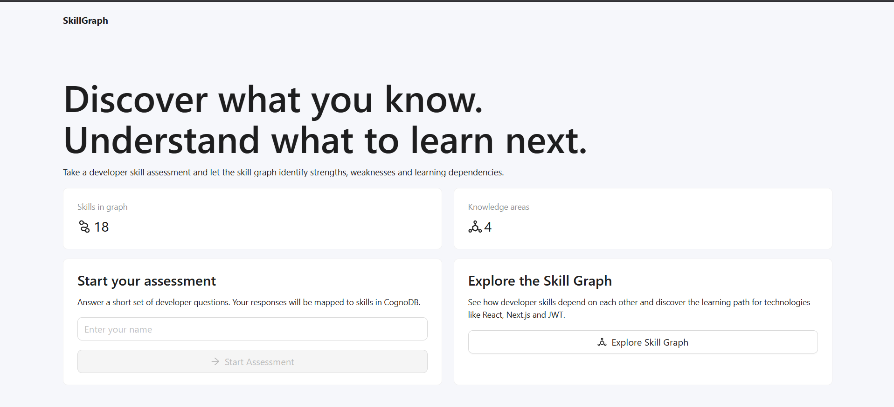
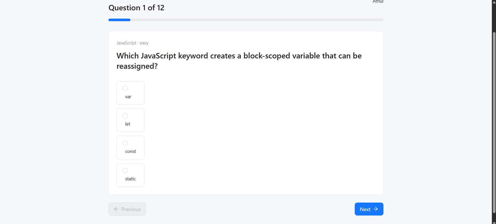
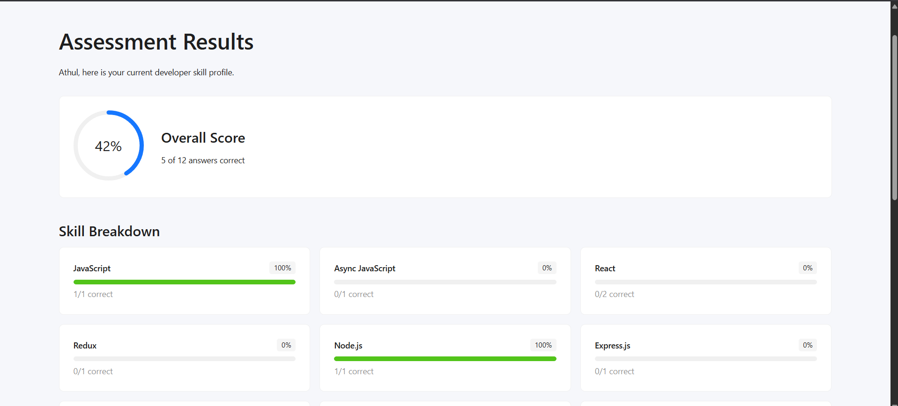

SkillGraph

SkillGraph is a developer skill assessment and skill-gap analysis application powered by CognoDB, a graph database compatible with openCypher and the Neo4j JavaScript driver.

Instead of only returning a quiz score, SkillGraph models how technical skills depend on one another. After a candidate completes the assessment, the application calculates skill-level scores and uses graph traversals to identify weaknesses and the higher-level skills those weaknesses may affect.

Live Demo

Frontend: https://skill-graph-wheat.vercel.app/

Backend API: https://skill-graph-ii9k.onrender.com

Backend Health Check: https://skill-graph-ii9k.onrender.com/api/health

GitHub Repository: https://github.com/Athulsudhakaran4736/skill-graph

- **Screen Recording:** [Watch the demo](https://www.loom.com/share/64fef03c02794e7e9f4712583b829fed)

Features

Developer skill assessment

Skill-level scoring

Personalized skill-gap analysis

Multi-hop prerequisite traversal

Interactive skill dependency explorer

Graph-based impact analysis for weak skills

Realistic seed data

Parameterized Cypher queries

Graceful API and database error handling

Responsive UI with loading, empty, and error states

Why a Graph Database?

The core problem in SkillGraph is not simply storing questions and scores. The interesting part is understanding the relationships between skills.

For example:

Next.js
↓ REQUIRES
React
↓ REQUIRES
JavaScript
↓ REQUIRES
Programming Fundamentals

A candidate may score poorly in JavaScript. That weakness can affect readiness for React and Next.js, even if those skills are not directly tested in the same question.

With a graph database, these relationships are stored as first-class connections and can be traversed naturally using Cypher.

A relational database could model the same information, but discovering arbitrary-depth prerequisite chains or determining which higher-level skills are affected by a weakness would require recursive queries or increasingly complex self-joins.

CognoDB allows SkillGraph to express these questions directly through graph traversal.

Example Graph Questions

SkillGraph can answer questions such as:

What skills are required before learning Next.js?

Which prerequisites are two or more levels deep?

Which skills are affected by a candidate's weakness in React?

Which assessment questions test a particular skill?

What knowledge areas does each skill belong to?

What learning dependencies connect one technology to another?

Technology Stack

Frontend

React

Vite

Ant Design

React Router

Axios

React Flow (@xyflow/react)

Backend

Node.js

Express.js

Neo4j JavaScript Driver

dotenv

CORS

Helmet

Database

CognoDB Cloud

openCypher

Bolt protocol

Deployment

Vercel — frontend

Render — backend

CognoDB Cloud — graph database

Architecture

flowchart TD
A[React + Vite Frontend Vercel] -->|REST API / HTTPS| B[Node.js + Express API Render]
B -->|Neo4j JavaScript Driver / Bolt| C[CognoDB Cloud]

    B --> D[Controllers]
    D --> E[Services]
    E --> F[Cypher Query Layer]
    F --> C

The frontend never connects directly to CognoDB. Database credentials remain on the backend and are read from environment variables.

## Graph Data Model

SkillGraph models candidates, assessment questions, technical skills, topics, and the relationships between them.

Nodes

Candidate

Represents a person who completes an assessment.

id
name
createdAt

Question

Represents an assessment question.

id
text
options
correctAnswer
difficulty

Skill

Represents a technical skill.

id
name
description

Topic

Represents a broad knowledge area.

id
name
description

Relationships

(:Question)-[:TESTS]->(:Skill)

Connects an assessment question to the skill it evaluates.

(:Skill)-[:BELONGS_TO]->(:Topic)

Places a skill inside a broader knowledge area.

(:Skill)-[:REQUIRES]->(:Skill)

Represents prerequisite knowledge.

Next.js -[:REQUIRES]-> React
React -[:REQUIRES]-> JavaScript

(:Skill)-[:RELATED_TO]->(:Skill)

Represents closely related technical skills.

(:Candidate)-[:ANSWERED]->(:Question)

Stores candidate responses.

Relationship properties:

answer
correct
answeredAt

(:Candidate)-[:HAS_SKILL]->(:Skill)

Stores assessment results for each tested skill.

Relationship properties:

score
correctAnswers
totalQuestions
assessedAt

Example Skill Graph

graph TD
PF[Programming Fundamentals]
JS[JavaScript]
ASYNC[Async JavaScript]
REACT[React]
STATE[State Management]
REDUX[Redux]
NEXT[Next.js]

    JS -->|REQUIRES| PF
    ASYNC -->|REQUIRES| JS
    REACT -->|REQUIRES| JS
    STATE -->|REQUIRES| JS
    REDUX -->|REQUIRES| REACT
    REDUX -->|REQUIRES| STATE
    NEXT -->|REQUIRES| REACT

This model enables multi-hop traversals such as:

Next.js
→ React
→ JavaScript
→ Programming Fundamentals

Main Cypher Queries

1. Find All Skills

MATCH (skill:Skill)
OPTIONAL MATCH (skill)-[:BELONGS_TO]->(topic:Topic)

RETURN
skill.id AS id,
skill.name AS name,
skill.description AS description,
topic.id AS topicId,
topic.name AS topicName

ORDER BY topic.name, skill.name

2. Multi-Hop Prerequisite Traversal

MATCH (skill:Skill {id: $skillId})

OPTIONAL MATCH path =
(skill)-[:REQUIRES*1..4]->(prerequisite:Skill)

RETURN
skill.id AS skillId,
skill.name AS skillName,
prerequisite.id AS id,
prerequisite.name AS name,
prerequisite.description AS description,
min(length(path)) AS distance

ORDER BY distance, name

The query follows REQUIRES relationships from one to four levels deep.

For nextjs:

React → 1 hop
JavaScript → 2 hops
Programming Fundamentals → 3 hops

3. Skill Gap Impact Analysis

MATCH (candidate:Candidate {
id: $candidateId
})-[assessment:HAS_SKILL]->(weakSkill:Skill)

WHERE assessment.score < $threshold

OPTIONAL MATCH path =
(affectedSkill:Skill) -[:REQUIRES*1..4]->
(weakSkill)

RETURN
weakSkill.id AS weakSkillId,
weakSkill.name AS weakSkillName,
assessment.score AS score,
affectedSkill.id AS affectedSkillId,
affectedSkill.name AS affectedSkillName,
CASE
WHEN path IS NULL THEN null
ELSE length(path)
END AS distance

ORDER BY score ASC, distance ASC

If a candidate performs poorly in React, the graph can discover that this may affect skills such as Next.js or Redux because those skills depend on React.

Parameterized Queries

All dynamic Cypher values are passed through Neo4j driver parameters.

await session.run(GET_SKILL_PREREQUISITES, {
skillId,
});

Cypher uses:

{id: $skillId}

instead of string concatenation.

Assessment Flow

flowchart TD
A[Candidate enters name] --> B[Load assessment questions]
B --> C[Candidate answers questions]
C --> D[Submit assessment]
D --> E[Validate answers on backend]
E --> F[Calculate score per skill]
F --> G[Create Candidate node]
G --> H[Create ANSWERED relationships]
H --> I[Create HAS_SKILL relationships]
I --> J[Traverse skill dependency graph]
J --> K[Return skill gaps and impacted skills]
K --> L[Display results]

API Endpoints

Base URL:

https://skill-graph-ii9k.onrender.com/api

Health

GET /api/health

Skills

GET /api/skills

GET /api/skills/:skillId

GET /api/skills/:skillId/prerequisites

GET /api/skills/:skillId/graph

Questions

GET /api/questions

Assessments

POST /api/assessments

Example request:

{
"candidateName": "Demo Candidate",
"answers": [
{
"questionId": "q1",
"answer": "let"
},
{
"questionId": "q2",
"answer": "await"
}
]
}

The backend:

Validates question IDs

Fetches correct answers from CognoDB

Evaluates submitted responses

Calculates skill scores

Creates the candidate

Creates ANSWERED relationships

Creates HAS_SKILL relationships

Runs graph-based skill-gap analysis

Project Structure

skill-graph/
│
├── client/
│ ├── src/
│ │ ├── components/
│ │ │ └── SkillGraphView.jsx
│ │ ├── pages/
│ │ │ ├── DashboardPage.jsx
│ │ │ ├── AssessmentPage.jsx
│ │ │ ├── ResultsPage.jsx
│ │ │ └── SkillExplorerPage.jsx
│ │ ├── services/
│ │ │ └── api.js
│ │ ├── App.jsx
│ │ ├── main.jsx
│ │ └── styles.css
│ ├── vercel.json
│ └── package.json
│
├── server/
│ ├── scripts/
│ │ ├── seed.js
│ │ └── seedData.js
│ ├── src/
│ │ ├── config/
│ │ │ └── database.js
│ │ ├── controllers/
│ │ ├── middleware/
│ │ ├── queries/
│ │ ├── routes/
│ │ ├── services/
│ │ ├── app.js
│ │ └── server.js
│ ├── .env.example
│ └── package.json
│
├── docs/
│ ├── graph-model.png
│ ├── dashboard.png
│ ├── assessment.png
│ ├── results.png
│ └── skill-explorer.png
│
├── .gitignore
└── README.md

Local Setup

Prerequisites

Node.js 20+

npm

Git

A CognoDB Cloud account

A CognoDB database instance

1. Clone the Repository

git clone https://github.com/Athulsudhakaran4736/skill-graph.git
cd skill-graph

2. Create a CognoDB Instance

Sign in to CognoDB Cloud.

Create a free c0 instance.

Select a suitable region.

Save the generated database password immediately.

Copy the Bolt connection URI.

Example connection URI:

bolt+s://<instance-id>.databases.cognodb.cloud

Default username:

cognodb

3. Backend Setup

cd server
npm install

Create server/.env:

PORT=5000
COGNODB_URI=bolt+s://YOUR_INSTANCE_ID.databases.cognodb.cloud
COGNODB_USERNAME=cognodb
COGNODB_PASSWORD=YOUR_PASSWORD
FRONTEND_URL=http://localhost:5173

Never commit this file.

4. Seed CognoDB

npm run seed

The seed script creates:

Topics

Skills

Questions

BELONGS_TO relationships

REQUIRES relationships

RELATED_TO relationships

TESTS relationships

It also verifies a sample multi-hop traversal.

5. Start the Backend

npm run dev

API:

http://localhost:5000

Health check:

http://localhost:5000/api/health

6. Frontend Setup

Open another terminal:

cd client
npm install

Create client/.env:

VITE_API_BASE_URL=http://localhost:5000/api

Run:

npm run dev

Open:

http://localhost:5173

Environment Variables

Backend

PORT=
COGNODB_URI=
COGNODB_USERNAME=
COGNODB_PASSWORD=
FRONTEND_URL=

FRONTEND_URL is used by the Express CORS configuration to allow requests from the frontend.

Production:

FRONTEND_URL=https://skill-graph-wheat.vercel.app

Frontend

VITE_API_BASE_URL=

Production:

VITE_API_BASE_URL=https://skill-graph-ii9k.onrender.com/api

Actual .env files are excluded from Git.

Error Handling

The application includes handling for:

Invalid candidate data

Missing assessment answers

Duplicate question submissions

Invalid question IDs

Missing skills

API errors

CognoDB connectivity failures

Frontend loading states

Frontend empty states

Frontend request failures

If CognoDB is unavailable, the API health endpoint returns an appropriate service-unavailable response rather than crashing silently.

## Screenshots

### Dashboard

### Assessment

### Assessment Results

### Skill Explorer

Deployment

React + Vite
│
▼
Vercel
│
│ HTTPS / REST
▼
Node.js + Express
│
▼
Render
│
│ Neo4j Driver / Bolt
▼
CognoDB Cloud

Frontend — Vercel

Production URL:

https://skill-graph-wheat.vercel.app/

Environment:

VITE_API_BASE_URL=https://skill-graph-ii9k.onrender.com/api

Backend — Render

Production URL:

https://skill-graph-ii9k.onrender.com

Environment:

COGNODB_URI=<CognoDB Bolt URI>
COGNODB_USERNAME=cognodb
COGNODB_PASSWORD=<CognoDB password>
FRONTEND_URL=https://skill-graph-wheat.vercel.app

Secrets are configured through the hosting provider and are not committed to the repository.

Database — CognoDB Cloud

CognoDB Cloud is accessed from the backend through the official Neo4j JavaScript driver over the Bolt protocol.

Security Notes

CognoDB credentials are never sent to the browser.

Database credentials are loaded through environment variables.

.env files are excluded from version control.

Correct assessment answers are not returned through the questions API.

Dynamic Cypher values use query parameters instead of string concatenation.

Database writes for an assessment are grouped in a transaction.

Future Improvements

Given more time, SkillGraph could be extended with:

Larger skill and question datasets

Candidate assessment history

Personalized learning paths

Difficulty-weighted scoring

More detailed graph visualization

Assessment categories

Skill search and filtering

Admin tooling for managing skills and questions

Authentication was intentionally left outside the current scope so the project could focus on graph modelling, traversal, assessment logic, and user experience.

Author

Athul Sudhakaran

License

This project was created as a technical take-home assessment.
